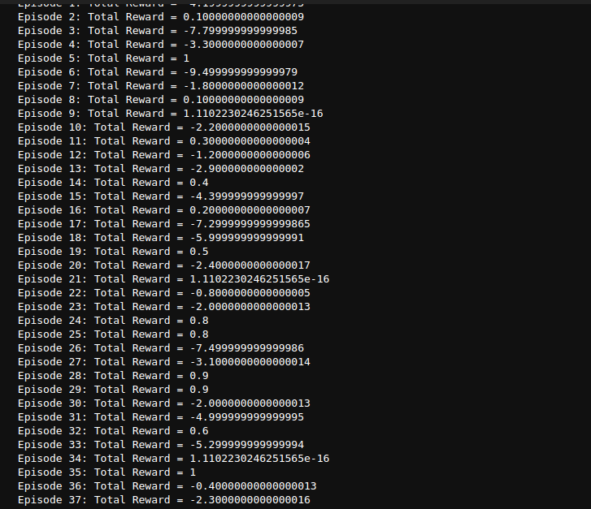

# Reinforcement Learning: Tag Game

A custom reinforcement learning environment where two agents (a chaser and a runner) play a tag game on a 5x5 grid. The algorithm trains the chaser using Q-learning to catch the runner.

---

## Images
### Image of reward system
  
### Video
  


---

## 🚀 Project Features
- **Custom Gym Environment**: A 5x5 grid with two agents.
- **Reinforcement Learning**: Implements Q-learning to train the chaser.
- **Interactive Simulation**: Visualizes the agents' movements in the grid.

---

## 📂 File Structure
- **`Reinforcement_Learning_Tag_Game.ipynb`**: Jupyter Notebook with the implementation.
- **`media/`**: Contains screenshots/GIFs of the simulation (optional).
- **`README.md`**: Project documentation.

---

## 🔧 Installation

### Prerequisites
- Python 3.7 or later
- Jupyter Notebook
- Libraries: `numpy`, `matplotlib`, `gym`

### Steps
1. Clone the repository:
   ```bash
   git clone https://github.com/<your-username>/Reinforcement-Learning-Tag-Game.git
   cd Reinforcement-Learning-Tag-Game

